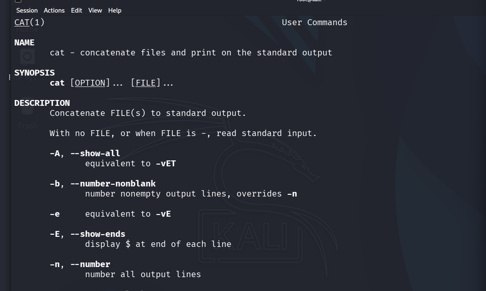

# Linux User Information Commands

## `man`
Displays the manual pages ("man pages") for the provided command and helps users understand its usage, options, and functionality.

**Example:**
```bash
man cat
```

## `passwd`
Sets or changes a user's password.

**Example:**
```bash
passwd
```

## `who`
Displays information about all users currently logged into the system, including:
- Username
- Login session details
- Terminal information
- Login time

**Example:**
```bash
who
```

## `whoami`
Displays the username of the current logged-in user.

**Example:**
```bash
whoami
```

## Screenshot



## Screenshot


